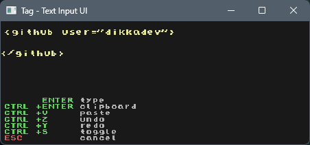

# Tag - XML Generator UI

A fast, lightweight Windows application for generating XML tags with attributes through a simple text interface.



## Features

- **Real-time XML generation** - See XML output update instantly as you type
- **Intuitive syntax** - Use tabs to separate tag names, attributes, and values
- **Smart attribute handling** - Automatically distinguishes boolean attributes from key-value pairs
- **Two output modes**:
  - **Type mode** (Enter) - Types XML directly into the active application with reliable Shift+Enter line breaks
  - **Clipboard mode** (Ctrl+Enter or Shift+Enter) - Copies XML to clipboard
- **Undo/Redo support** - Undo changes with Ctrl+Z and redo with Ctrl+Y
- **Clipboard paste** - Paste clipboard content into a value (after first tab) using Ctrl+V
- **XML mode toggle** - Switch between regular tags and self-closing tags (e.g., `<br />`) with Ctrl+S
- **Special character escaping** - Replaces unsupported characters with `~` and escapes `&`, `<`, `>`, and `"` in attribute values
- **Text wrapping** - Automatically wraps long lines in the display view for readability
- **Multi-monitor support** - Opens on the monitor where your mouse cursor is located
- **Clean, modern UI** - Built with the Sokol graphics library

## Quick Start

1. Run `tag.exe`
2. Type your tag structure using tabs to separate elements
3. (Optional) Use Ctrl+V to paste clipboard content into an attribute value, Ctrl+Z/Ctrl+Y to undo/redo, or Ctrl+S to toggle between regular and self-closing tag modes
4. Press Enter to type the XML into the active window, or Ctrl+Enter/Shift+Enter to copy XML to the clipboard and quit

## Examples

### Simple tag
**Input:**
```
div
```
**Output:**
```xml
<div>

</div>
```

### Tag with attributes
**Input:**
```
img<tab>src<tab>photo.jpg<tab>alt<tab>A photo
```
**Output:**
```xml


</img>
```

### Mixed boolean and key-value attributes
**Input:**
```
button<tab>disabled<tab><tab>type<tab>submit
```
**Output:**
```xml
<button disabled type="submit">

</button>
```

## Controls

- **Type characters** - Build your tag structure
- **TAB** - Insert tab character (separates tag name, attributes, values)
- **BACKSPACE** - Delete last character
- **ENTER** - Close the app and type XML with reliable Shift+Enter line breaks
- **CTRL+ENTER** or **SHIFT+ENTER** - Copy XML to clipboard and quit
- **CTRL+V** - Paste clipboard content into a value (after first tab)
- **CTRL+Z** - Undo last action
- **CTRL+Y** - Redo last undone action
- **CTRL+S** - Toggle between regular and self-closing XML modes
- **ESC** - Cancel and quit immediately

## Building

### Prerequisites
- [Zig](https://ziglang.org/) (latest)

### Build Commands
```bash
# Debug build (shows console logs)
zig build

# Release build (no console window)
zig build -Doptimize=ReleaseFast

# Run tests
zig build test

# Run directly
zig build run
```

## Acknowledgments

**Special thanks to [SUI (Simple User Input)](https://github.com/Finxx1/SUI)** - This project relies on the excellent SUI library by Finxx1 for reliable keyboard input simulation on Windows. SUI provides the robust foundation that makes the typing functionality work seamlessly across different applications.

## Technical Details

- **Language**: Zig
- **Graphics**: [Sokol](https://github.com/floooh/sokol) 
- **Input Simulation**: [SUI](https://github.com/Finxx1/SUI) by Finxx1
- **Platform**: Windows (input simulation is Windows-specific)
- **Architecture**: Single executable, no external dependencies

## License

MIT License - see [LICENSE](LICENSE) file for details. 
